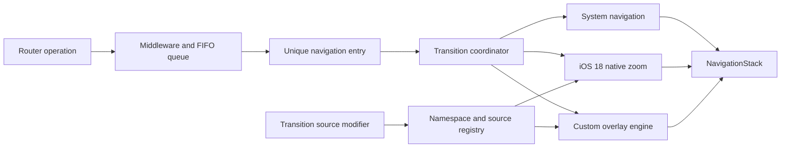

# KVRouterKit Navigation Transitions Design

Date: 2026-08-11
Status: Approved design, pending implementation plan

## 1. Overview

Rename the Swift package and module from `KVRouter` to `KVRouterKit`, while
keeping the existing public symbols such as `KVAppRouter`, `KVRouterHost`, and
`KVAppRoute`.

Add configurable push and pop transitions with these guarantees:

- A host-level default transition and a per-navigation override.
- Multiple built-in styles plus a progress-driven custom transition API.
- Interactive edge-swipe pop for built-in custom transitions.
- Native SwiftUI zoom navigation on iOS 18 and later.
- A high-quality snapshot-based hero zoom fallback on iOS 16 and 17.
- Existing middleware, FIFO ordering, state restoration, dynamic view cleanup,
  and public route APIs continue to work.

This feature applies only to push and pop navigation. Sheet and full-screen
cover presentation remain unchanged.

## 2. Goals

- Rename the package product, module, source target, test target, and example
  app to `KVRouterKit`.
- Preserve current public type names and router behavior.
- Keep `.system` as the default so existing applications retain their current
  navigation behavior after changing the module import.
- Let applications select a default transition in `KVRouterHost` and override
  it on each push or replacement operation.
- Support reverse transitions automatically when popping.
- Support rapid queued navigation without overlapping custom transition state.
- Respect Reduce Motion and safely handle interruption, cancellation, and app
  lifecycle changes.

## 3. Non-goals

- Custom sheet or full-screen cover animations.
- Persisting custom transition closures as part of state restoration.
- Replacing public route values with a new public route model.
- Exposing UIKit types through the public API.
- Renaming existing public symbols such as `KVAppRouter`.
- Renaming the GitHub repository through local source changes.

## 4. Package Rename

The package layout becomes:

```text
Package: KVRouterKit
Product: KVRouterKit
Target: KVRouterKit
Sources: Sources/KVRouterKit
Tests: Tests/KVRouterKitTests
Example: KVRouterKitExample
```

Applications migrate from:

```swift
import KVRouter
```

to:

```swift
import KVRouterKit
```

README installation examples continue to use the existing `KVRouter.git`
repository URL. Renaming the GitHub repository remains a separate manual
operation, and GitHub can redirect the old URL if that happens later. Because
changing a module name is source-breaking, this release uses a new major
version.

## 5. Public Transition API

### 5.1 Host default

`KVRouterHost` accepts a default transition. The default value is `.system`.

```swift
KVRouterHost(
    router: router,
    defaultTransition: .system
) {
    HomeView()
}
```

The host resolves an entry's transition as:

```text
per-operation override -> host default -> .system
```

### 5.2 Per-operation override

Existing methods remain available. New overloads accept a transition:

```swift
router.push(
    .appFeature("profile"),
    transition: .sharedAxis
)

router.pushView(transition: .depth) {
    DetailView()
}

router.replaceTop(
    with: .appFeature("settings"),
    transition: .fade
)

router.replaceTopWithView(transition: .scaleAndFade) {
    SettingsView()
}
```

The existing no-transition overloads preserve source compatibility and record
no override, allowing the host default to apply.

`setPath` and `restorePath` use the host default because they describe route
state rather than a sequence of persisted visual effects. They replace the path
atomically and animate only from the current top screen to the final top screen;
intermediate routes are not presented one by one. Deep links use the host
default in this release.

### 5.3 Built-in styles

`KVNavigationTransition` is a public value type with static factories rather
than a public closed enum. This permits future styles without expanding a
public exhaustive switch.

Version 1 of the transition feature includes:

```swift
.system
.slide(edge: .trailing)
.fade
.scale
.scaleAndFade
.sharedAxis(axis: .horizontal)
.depth
.reveal(origin: .topTrailing)
.flip3D(axis: .vertical)
.zoom(sourceID: product.id)
.custom(...)
```

Built-in values expose an animation override without changing the style:

```swift
let transition = KVNavigationTransition.depth
    .animation(.spring(response: 0.5, dampingFraction: 0.86))
```

Each built-in defines both incoming and outgoing transforms for push and pop.
Pop automatically reverses the transition stored for the current top entry.

### 5.4 Hero source

Applications mark the source element and pass the same stable ID when pushing:

```swift
ProductCard(product)
    .kvTransitionSource(id: product.id)
    .onTapGesture {
        router.pushView(
            transition: .zoom(sourceID: product.id)
        ) {
            ProductDetail(product: product)
        }
    }
```

`kvTransitionSource(id:)` hides all OS-specific behavior. It registers source
visibility and geometry with the host on every supported OS. On iOS 18 and later
it additionally applies SwiftUI's `matchedTransitionSource(id:in:)`. On iOS 16
and 17 the coordinator captures an in-memory source snapshot when the transition
begins.

The namespace is owned by `KVRouterHost` and passed through a private
environment value. Applications do not create or pass a `Namespace.ID`.

## 6. Custom Transition API

Custom transitions are progress-driven so the same definition works for
programmatic navigation and interactive pop.

Conceptual usage:

```swift
let cardTurn = KVNavigationTransition.custom(
    animation: .spring(response: 0.55, dampingFraction: 0.82),
    interactiveBack: true
) { content, context in
    content
        .opacity(context.opacity(from: 0))
        .scaleEffect(context.scale(from: 0.86))
        .rotation3DEffect(
            context.angle(from: 18),
            axis: (x: 0, y: 1, z: 0)
        )
}
```

The public `KVTransitionContext` contains:

- `progress`, clamped to `0...1`.
- `role`: incoming or outgoing.
- `operation`: push or pop.
- `containerSize`.
- `isInteractive`.
- `reduceMotion`.
- Helper functions that calculate direction-aware opacity, offset, scale, and
  rotation values.

The transform closure is type-erased inside `KVNavigationTransition`; callers
do not handle `AnyView` directly. Custom closures are main-actor isolated and
remain in memory only.

When `interactiveBack` is false, the custom edge gesture is disabled while that
entry is on top. Programmatic pop still uses the custom reverse animation.

## 7. Internal Route Entries

The existing public `path` remains `[KVAppRoute]`. Internally, navigation uses a
unique entry model:

```text
KVNavigationEntry
  id: UUID
  route: KVAppRoute
```

Transition configuration is stored in a registry keyed by entry ID instead of
inside the hashable entry. This is necessary because custom transitions contain
closures and are neither hashable nor codable.

The internal entry identity solves these cases:

- The same typed route can be pushed multiple times with different styles.
- Transition metadata can be removed precisely when an entry is popped.
- Navigation destinations can identify the exact path occurrence.
- Public state restoration continues to encode only `[KVAppRoute]`.

When external or system behavior shortens the public path, the router reconciles
and removes the corresponding internal entries, view builders, transition
metadata, and snapshots.

Direct assignment to the public `path` setter reconciles the longest unchanged
prefix, reuses its entry identities, removes entries outside that prefix, and
creates new suffix entries without per-operation overrides. The host default
therefore applies to newly assigned routes. `NavigationStack` binds to the
internal entry path, while public observation continues to report `[KVAppRoute]`.

## 8. Host Architecture

`KVRouterHost` continues to own a `NavigationStack`, with three additional
private collaborators:

- A shared transition namespace.
- A source and snapshot registry.
- `KVTransitionCoordinator`, the transition state machine.



### 8.1 Transition backend selection

| Requested style | iOS 16-17 | iOS 18+ |
| --- | --- | --- |
| `.system` | Native system navigation | Native system navigation |
| `.zoom` | Custom hero engine | Native SwiftUI zoom |
| Other built-ins | Custom overlay engine | Custom overlay engine |
| `.custom` | Custom overlay engine | Custom overlay engine |

The verified iOS 18 APIs are:

```swift
matchedTransitionSource(id:in:)
navigationTransition(.zoom(sourceID:in:))
```

All references to these APIs are guarded by `#available(iOS 18.0, *)`.

## 9. Custom Overlay Engine

### 9.1 Programmatic push

After middleware approves the final route:

1. Resolve the per-operation override or host default.
2. Revalidate any hero source immediately before transition preparation.
3. Capture the outgoing screen and, for hero zoom, the registered source.
4. Append the internal entry with the native `NavigationStack` animation
   disabled.
5. Render the real destination once in its initial transition state.
6. Animate destination and overlay progress from `0` to `1`.
7. Remove temporary snapshots and mark the coordinator idle.

The destination is not rendered in a disposable preview tree, avoiding duplicate
`onAppear`, `.task`, and local state initialization.

### 9.2 Programmatic pop

1. Capture the outgoing top screen.
2. Remove the entry with native animation disabled, revealing the existing
   underlying destination.
3. Animate the outgoing snapshot and underlying live screen using the stored
   transition in reverse.
4. Clean up route builders, transition metadata, and snapshots when animation
   completes.

### 9.3 Interactive pop

The custom gesture starts from the leading edge, respecting layout direction.
It begins only when horizontal intent is dominant, reducing conflicts with
vertical scrolling and controls.

During the gesture:

- The router path is not mutated.
- A cached snapshot of the previous screen is shown underneath the current live
  screen.
- Drag distance drives transition progress directly.
- Release velocity and progress decide whether to finish or cancel.

On finish, the visual transition reaches `1` before the router commits the pop
without native animation. On cancel, progress returns to `0` and the path is
unchanged.

All built-in custom styles support interactive pop. `.system` and native iOS 18
zoom rely on the system gesture. Custom definitions opt in with
`interactiveBack: true`.

## 10. Hero Zoom Behavior

### 10.1 iOS 18 and later

- The source modifier applies `matchedTransitionSource` using the host namespace.
- The destination entry applies `navigationTransition(.zoom(...))`.
- SwiftUI owns push, pop, clipping, and interactive behavior.

### 10.2 iOS 16 and 17

- The source modifier records its frame in the host coordinate space.
- The internal snapshot bridge captures the source content without exposing
  UIKit publicly.
- The full destination screen begins at the source frame's relative position,
  scale, and corner geometry, then expands to the container bounds.
- The outgoing screen fades and scales subtly to preserve depth.
- Pop runs the geometry in reverse when the original source is still valid.
- If the original source is no longer visible, pop uses `.scaleAndFade` rather
  than animating to an incorrect frame.

Snapshots are in-memory only and never written to disk. Inactive screen
snapshots live in a cost-limited `NSCache`, so recent screens support repeated
interactive pops without unbounded memory growth. The cache may evict entries
under pressure; a missing cached screen uses the documented noninteractive
fallback instead of blocking navigation.

## 11. Built-in Motion Semantics

- `.slide`: incoming screen moves from the configured edge; outgoing screen has
  a smaller parallax displacement.
- `.fade`: symmetric opacity transition.
- `.scale`: incoming and outgoing screens use inverse scale curves.
- `.scaleAndFade`: scale plus opacity for a softer non-spatial transition.
- `.sharedAxis`: both screens move along the same axis with offset, scale, and
  opacity to communicate hierarchy.
- `.depth`: outgoing content recedes and softens while incoming content advances.
- `.reveal`: incoming content expands from a configurable origin using a mask.
- `.flip3D`: restrained perspective rotation with opacity protection around the
  edge-on portion.
- `.zoom`: shared-source hero expansion, native on iOS 18 and custom on older OS
  versions.

Default timings are style-specific. Every style can override its animation.
No built-in animation loops.

## 12. Queueing and State Machine

`KVTransitionCoordinator` has explicit phases:

```text
idle
preparing
animating
interactive
settling
cleaningUp
```

Custom navigation operations await coordinator completion before the FIFO queue
starts the next visual transition. Completion is driven by animation progress,
not a hardcoded sleep. iOS 16 uses an animatable completion observer; newer OS
versions may use native transaction completion where appropriate.

If middleware redirects a route, the transition applies to the final route. If
middleware cancels, no entry or snapshot is retained.

If an interactive gesture is active, queued programmatic navigation waits until
the gesture finishes or cancels.

## 13. Accessibility and Lifecycle

- Native transitions defer Reduce Motion behavior to SwiftUI.
- Custom transitions collapse to a short crossfade when Reduce Motion is on.
- Interactive back remains available with reduced motion.
- Transition source modifiers do not change accessibility labels, traits, or hit
  testing.
- Entering the background, changing Reduce Motion, or losing the active scene
  forces the coordinator to the nearest stable end state and removes overlays.
- Rotation or container resizing during preparation causes geometry to be
  recalculated before animation starts.

## 14. Failure and Fallback Rules

- Missing or duplicate visible zoom source: use `.scaleAndFade` and emit a
  `DEBUG` warning.
- Source disappears while async middleware runs: revalidate and fallback.
- Source becomes invalid during a reverse zoom: use `.scaleAndFade` for pop.
- Snapshot capture fails: use a live destination crossfade.
- Previous-screen snapshot was evicted: disable interactive preview for that
  gesture and allow programmatic pop with `.scaleAndFade`.
- Restored path: use the host default because transition closures and overrides
  are not persisted.
- Interrupted custom animation: settle to the nearest stable state, reconcile
  entries and public path, then clean all temporary state.
- Unknown or unsupported configuration never leaves an invisible destination or
  a blocked navigation queue.

## 15. Testing Strategy

### 15.1 Router and metadata tests

- Existing no-transition APIs preserve behavior.
- Host default and per-operation override resolve correctly.
- Duplicate typed routes retain distinct entry IDs and styles.
- Replace, pop, pop-to, pop-count, and pop-to-root clean transition metadata.
- Middleware redirect and cancellation do not leak entries or snapshots.
- Restore path recreates entries with the host default.
- Rapid operations retain FIFO order.

### 15.2 Coordinator tests

- Every legal state transition reaches `idle` and cleans temporary state.
- Programmatic push and pop reach progress `1` and reverse correctly.
- Interactive finish and cancel honor progress and velocity decisions.
- App lifecycle interruption settles deterministically.
- Missing hero source selects the documented fallback.
- Reduce Motion selects crossfade behavior.

### 15.3 Availability and integration tests

- Package deployment target remains iOS 16.
- iOS 18 APIs compile only inside availability guards.
- The current simulator runs the package test suite.
- The example app builds after the module and target rename.
- Manual example coverage includes every built-in, native hero zoom, fallback
  hero zoom where an older runtime is available, and edge-swipe cancellation.

Animation pixels and native SwiftUI transition internals are not asserted in
unit tests. Geometry resolution, state-machine progress, backend selection, and
cleanup are isolated behind testable internal components.

## 16. Documentation and Example App

README updates include:

- New package and repository name.
- Migration from `import KVRouter` to `import KVRouterKit`.
- Host default and per-push transition examples.
- Hero source setup.
- Custom progress-driven transition example.
- iOS support matrix and fallback behavior.
- Reduce Motion and restoration notes.

`KVRouterKitExample` adds a transition gallery with controls for all built-ins,
a list-to-detail hero demo, rapid navigation, interactive finish/cancel, and a
missing-source fallback example.

## 17. Acceptance Criteria

- Package clients import `KVRouterKit`; existing public router symbols remain.
- Existing navigation tests pass after the rename.
- The default configuration behaves like the current package.
- Every approved built-in style works for programmatic push and pop.
- Built-in custom styles support interactive edge pop.
- iOS 18 and later use SwiftUI's native zoom transition.
- iOS 16 and 17 use the custom hero fallback with the same public call site.
- Missing hero sources fail gracefully without blocking navigation.
- Custom transitions can derive arbitrary view modifiers from progress and can
  opt into interactive back.
- Reduce Motion, interruption, middleware cancellation, and rapid operations
  leave the coordinator and router in a consistent idle state.
- README and example app document and demonstrate the complete public API.
